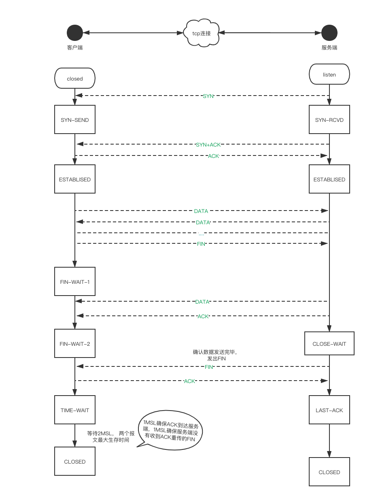

# 网络及浏览器相关知识点

## http1.0和http2.0

区别：
  - http2.0多路复用
  - http2.0头部压缩
  - http2.0服务器推送
  - http2.0二进制协议

### 多路复用
虽然http1.1增加了长链接，可以在一个tcp连接上发送多个http请求，但是一旦请求多了效率就会变慢，造成`线端阻塞`。多路复用同一个tcp连接处理的并发请求量级是长链接的好几个数量级，极大提高传输性能

### 头部压缩
http1.1中，请求主体会经过gzip压缩，但是头部不会，随着web功能越来越复杂，头部的大小也在增加，HTTP2.0使用HPACK算法对header的数据进行压缩，这样数据体积小了，在网络上传输就会更快。

### 服务器推送
减少网络空闲时间浪费，主动推送。

### 二进制协议
在应用层（http2.0）和传输层（tcp or udp）增加一个二进制分帧层，在二进制分帧层上，http2.0会将所有传输的的信息分成更小的消息和帧，采用二进制编码，首部信息为headers帧，body将会封装成data帧

## [http和https的区别](http和https.md)

https相对于http基础上加了ssl，默认端口http是80、https是443

## 常用状态码

- 1xx：请求已接受，继续处理
- 2xx：成功
- [3xx：重定向，要完成请求必须进行更进一步的操作。](./重定向.md)
- 4xx：客户端错误，请求有语法错误或者无法实现。
- 5xx：服务端错误，服务端未合法实现请求。

常见：
- 301：永久重定向（链接更新）
- 302：临时重定向（链接不更新）
- 304：使用缓存
- 307：类似302，确保请求方法和消息主体不会发生改变。
- 308：类似301，确保请求方法和消息主体不会发生改变。
- 401：缺乏身份验证
- 403：拒绝授权访问
- 404：无法找到请求资源
- 405：服务器禁止当前发送的请求方法
- 410：无法找到请求资源（永久丢失）
- 414：请求url超过服务器允许限制范围
- 431：请求头字段的值过大，需要缩减头部体积
- 500：服务器遇到意外情况并阻止了请求
- 501：请求头里面的method或者content-*不被服务器支持
- 502：表示作为代理的服务器从上游中接收到的响应是无效的。
- 503：服务器尚未处于可接收请求的状态，在维护中或者超载。
- 504：超时

## get post

| get | post |
| - | - |
| 能被缓存 | 不能被缓存 |
| 幂等 | 不幂等 |
| 参数保留浏览器历史 | 参数不保留浏览器历史 |
| 数据长度为url长度，2048字符 | 无限制 |
| 只允许ASCII字符 | 无限制 |
| 与post相比安全性较差，参数在url上 | 稍微安全 |

## tcp三次握手和四次挥手



## tcp和udp的区别

| UDP | TCP |
| - | - |
| 无连接 | 面向连接 |
| 不可靠，不使用流量控制和拥塞控制，可能会丢包 | 可靠，使用流量控制和拥塞控制 |
| 支持一对一，一对多，多对一，多对多通信 | 只能一对一 |
| 面向报文传输 | 面向字节流传输 |
| 首部开销小仅8字节 | 首部最小20字节，最大60字节 |
| 适用于电话、视频会议、直播等实时性要求高的场景 | 适用于可靠传输，如文件上传 |

## 跨域

由于浏览器`同源策略`限制，浏览器会拦截跨域请求的资源。会跨域的标识：`协议、端口、域名不同`。

### 解决跨域的的方案：

- JSONP

利用script标签特性，加载script的时候不会受跨域限制。前后端配合。
```js
/*
  jsonp 原理：
  其本质是利用了标签具有可跨域的特性，
  由服务端返回预先定义好的javascript函数的调用，
  并且将服务端数据以该函数参数的形式传递过来。
*/

(function(window, doucment){
	window.jsonp_cbs = {};
	var jsonp = function(url, data, callback){
		var queryString = url.indexOf('?')==-1?'?':'&';
		for(var key in data){
			queryString += key + '=' + data[key] + '&';
		}

		var fnSuffix=Math.random().toString().replace('.','');
		var cbFunName = "my_jsonp_name"+fnSuffix;
		queryString += 'callback=' + cbFunName;  //给请求路径末尾添加callback

		//创建script标签
		var scriptTag = document.createElement('script');
		scriptTag.src = url + queryString;
		document.body.appendChild(scriptTag);

		//将回调函数挂载在全局的jsonp_cbs对象里面。
		window[cbFunName] = function(data){
			callback(data);
			document.body.removeChild(scriptTag);  //回调函数处理完成删除标签
			window.jsonp_cbs[cbFunName] = null;
		}
	}
	window.$jsonp = jsonp;
})(window, document);
```
服务端返回一个可执行的js，调用callback
需要客户端与服务端约定好。

> 缺点：仅支持get请求。

- CORS

服务端设置 `Access-Control-Allow-Origin` 请求头去表示哪些域名可以访问资源。
设置CORS会有简单请求和非简单请求两种情况。

以下情况我为简单请求
```
GET
HEAD
POST
Content-Type 的值仅限于下列三者之一：
    text/plain
    multipart/form-data
    application/x-www-form-urlencoded
```

非简单请求会先发出一个options预检请求，去知道服务端是否允许跨域。

> 缺点：不兼容IE10以下

- postMessage

用于不同window对象相互之间发送消息。

```js
// 发送消息
window.postMessage('message', 'http://test.com')
// 接收消息
window.addEventListener('message', receiveMessage)
```
- WebSocket

WebSocket协议不实行同源策略

- domain 降域

如果两个窗口以及域名相同，只是二级域名不通，如 http://a.test.com 和 http://b.test.com ,可以通过设置 document.cookie="test.com"实现跨域。

> 使用 document.domain 来允许子域安全访问其父域时，您需要在父域和子域中设置 document.domain 为相同的值。这是必要的，即使这样做只是将父域设置回其原始值。不这样做可能会导致权限错误。


## 常见安全攻击及防御措施

### DOS 和 DDOS

拒绝服务和分布式拒绝服务攻击，原理相同，攻击者发起大量请求造成服务器资源过载，接口服务不可用。

大致常见的有：
- SYN Foold

利用tcp三次握手中的缺陷，发送大量的半连接请求消耗资源，导致服务不可用。在tcp三次握手中， 第二次的时候由服务端发出SYN+ACK包，然后如果客户端一直不发送ACK确认包，那么服务端会尝试重试并等待一段时间超时后才会丢弃这个半连接请求，在重试中，这些半连接请求会一直占用缓冲区。

> 应对方式：`缩短SYN超时时间`、`限制半连接个数，如果半连接个数达到上限，丢弃最早的缓冲区里面的半连接`、`设置SYN Cookie， 给每个IP地址分配一个，如果短时间内连续收到某个IP的重复SYN报文，就判断是受到了攻击，以后来自这个IP的SYN包都丢弃`
> 
- ACK Foold

在TCP连接建立之后，所有数据传输都是带ACK标志位的，主机在收到一个带有ACK标志位的报文的时候，需要检查所表示的四元组是否存在，如果存在再检查是否合法，合法就再给应用层传递，不合法就返回RST包告诉对方端口不存在。

这个过程中，服务器检查四元组需要查表、不合法要返回RST包。需要占用防火墙资源。

> 相较于SYN Foold对服务器冲击小点

- Connection Foold

典型的利用小流量冲击大带宽网络服务的攻击方式。
用真实的IP发起大量http连接，并且长期不释放，定时发送垃圾数据保持连接，消耗服务器资源。

> 应对方式：`一般可以在防火墙上限制每个IP地址每秒钟的连接数来防护`。

- UDP Foold

基于UPD 无连接特性，伪造大量的源IP去发送UDP包，大流量攻击。

**其他应对方法：**

优化网络架构，采用负载均衡、限制IP请求频率

### XSS

跨站脚本攻击，简称XSS，是一种代码注入攻击。攻击者通过在目标网站上注入恶意脚本，使用户在浏览器上运行。利用这些恶意脚本去获取用户敏感信息（cookie、sessionID等），进而危害用户安全。

#### 反射型

反射型 XSS 攻击步骤：
1. 攻击者构造出特殊的URL，其中包含恶意代码。
2. 用户打开URL，网站服务端将恶意代码从URL中取出，拼接在HTML中返回。
3. 用户浏览器解析服务端返回的HTML，混在HTML中的恶意代码也被执行。
4. 恶意代码窃取用户数据并发送到攻击者的网站。

反射型 XSS 漏洞常见于通过URL传递，如搜索、跳转等。

#### 存储型

存储型 XSS 攻击步骤：
1. 攻击者将恶意代码提交到目标网站的数据库中。
2. 用户打开目标网站的时候，服务端将恶意代码从数据库中取出，并且返回给浏览器执行。
3. 恶意代码窃取用户数据并发送到攻击者的网站。

存储型 XSS 漏洞常见于有用户保存数据的网站功能，如评论、发帖、私信等。

#### DOM型

DOM 型 XSS 攻击步骤：
1. 攻击者构造出特殊的URL，其中包含恶意代码。
2. 用户打开URL。
3. 用户浏览器接收响应并解析，前端 JavaScript 取出 URL 中的恶意代码并执行。
4. 恶意代码窃取用户数据并发送到攻击者的网站。

DOM 型 XSS 与前两种的区别在于：前两种属于服务端，DOM 型 XSS 是由前端浏览器的 JavaScript 执行恶意代码，属于前端 JavaScript 漏洞。

**预防 XSS 措施**

- 输入过滤
- 预防存储型和反射型 XSS 攻击：改成前端渲染，对HTML做转义
- 预防 DOM 型 XSS 攻击：不要把不可信的数据作为 HTML 插到页面上，插入前做过滤、检查校验或者转义
- HttpOnly Cookie: 禁止 JavaScript 读取某些敏感 Cookie，攻击者完成 XSS 注入后也无法窃取此 Cookie


### CSRF

跨站请求伪造，攻击者诱导受害者进入第三方网站，在第三方网站中，向被攻击网站发起跨站请求，利用受害者在被攻击网站认证的身份（cookie），去冒充受害者执行操作，让受害者造成损失。

CSRF 攻击步骤：
1. 受害者登陆网站A，并且保留了登陆认证信息（cookie）。
2. 攻击者诱导受害者打开网站B。
3. 网站B向网站A登陆的服务发起请求。
4. 网站A登陆的服务对请求验证，确认为受害者认证凭证。
5. 网站B发送的请求以受害者身份发送请求，执行操作。
6. 攻击完成，在受害者不知情下，攻击者完成了攻击操作。

#### 常见的 CSRF 类型

- GET 类型

``` html
	
```
用img标签发起请求，请求中会携带cookie

- POST 类型

``` html
<form action="https://172.20.204.32:3000/postMoney" method=POST>
    <input type="hidden" name="account" value="xiaoming" />
    <input type="hidden" name="amount" value="10000" />
    <input type="hidden" name="for" value="hacker" />
</form>
<script> document.forms[0].submit(); </script> 
```
用form表单去提交post请求

- 链接 类型

``` html
  <a href="https://172.20.204.32:3000/getMoney" taget="_blank">
    重磅消息！！
  <a/>
```
类似 GET 类型，不过需要诱导受害者去点击，比如广告、弹窗之类的。

#### CSRF 防护策略

- 组织不明外域的访问。
  - 同源策略，Referer Check 检查来源
  - cookie 设置 Samesite
- 提交时要求加入验证
  - 验证码
  - token
- 设置 http-only

**注意**

Chrome 51 开始，Samesite 默认为 lax，cookie允许与顶级导航一起发送。默认会过滤掉不同顶级域的cookie。

## [ssl加密过程](SSL加密过程.md)

## 从一个URL到页面展示发生了什么

1. 域名解析

浏览器缓存 ->  操作系统缓存 -> 路由缓存 -> ISP -> 根服务器（递归查询）

2. tcp三次握手
3. 发送http请求

强缓存(200)Expires、Cache-Control -> 协商缓存(304) Etag、Last-Modified

4. 接收到text/html（文档）类型
5. 四次挥手
6. 浏览器渲染（dom树、css规则树、layout、paint）
